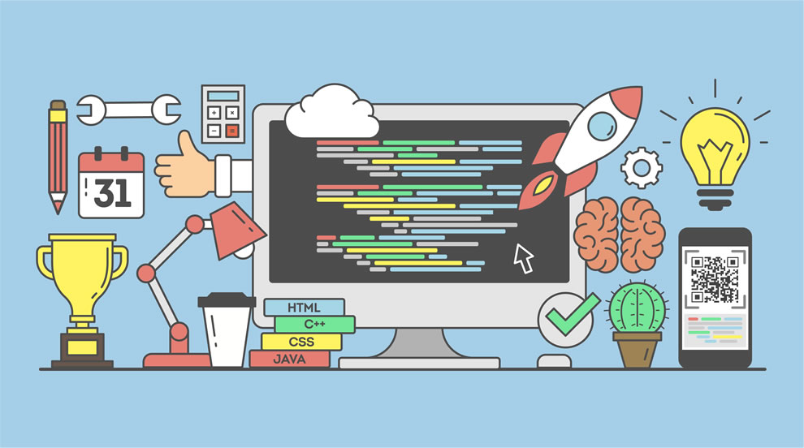

# Archivos

## Java
## JavaScript JS
## Python
## Cobol
##  HTML
## Programación

Aprende a programar
- Leyendo
- Estudiando
- Revisando código de otr@s

# Es posible y entretenido aprender programación 

  

 # **El arte desafía A la tecnología y la tecnología inspira al arte.** John Lasseter
